# 解题方案
- [解题方案](#解题方案)
- [1、解题思路](#1解题思路)
- [2、垃圾桶的设计](#2垃圾桶的设计)
  - [方案1：转台](#方案1转台)
  - [方案2：垃圾口倾倒](#方案2垃圾口倾倒)
  - [其他方案](#其他方案)
- [3、硬件方案](#3硬件方案)
  - [嵌入式平台选择](#嵌入式平台选择)
    - [Raspberry + Intel Neural Computer Stick](#raspberry--intel-neural-computer-stick)
    - [Nvidia Jetson Nano](#nvidia-jetson-nano)
  - [单片机选择](#单片机选择)
  - [显示屏选择](#显示屏选择)
  - [摄像头选择](#摄像头选择)
  - [舵机选择](#舵机选择)
- [4、软件方案](#4软件方案)
  - [神经网络训练](#神经网络训练)
    - [数据集准备](#数据集准备)
    - [深度学习框架的选择](#深度学习框架的选择)
      - [Tensorflow](#tensorflow)
      - [pytorc](#pytorc)
    - [神经网络搭建](#神经网络搭建)
    - [模型训练](#模型训练)
    - [模型测试和优化](#模型测试和优化)
  - [垃圾分类程序](#垃圾分类程序)
  - [显示程序](#显示程序)
  - [单片机上的程序](#单片机上的程序)
    - [PWM 输出](#pwm-输出)
    - [外部传感器中断](#外部传感器中断)

# 1、解题思路

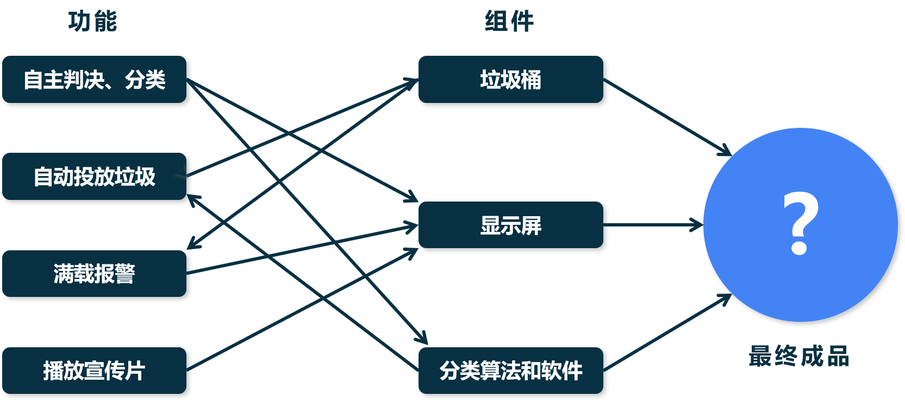

根据赛题的要求，逐个完成每个功能

- **自主判决和分类**：这里需要一个垃圾分类的算法，这里选择深度学习的方法进行垃圾分类
- **自动垃圾投放**：需要根据分类结果进行判断，再由硬件控制垃圾桶
- **满载报警**：根据垃圾桶的内部空间的状态进行检测判断
- **播放宣传片**：播放宣传片是需要在没有垃圾投放的空闲时间进行的


# 2、垃圾桶的设计

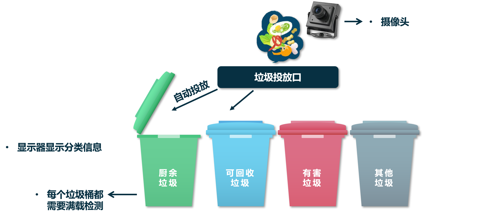

垃圾桶的设计包含了四个垃圾桶、垃圾桶投放口、摄像头、显示器等组成

## 方案1：转台

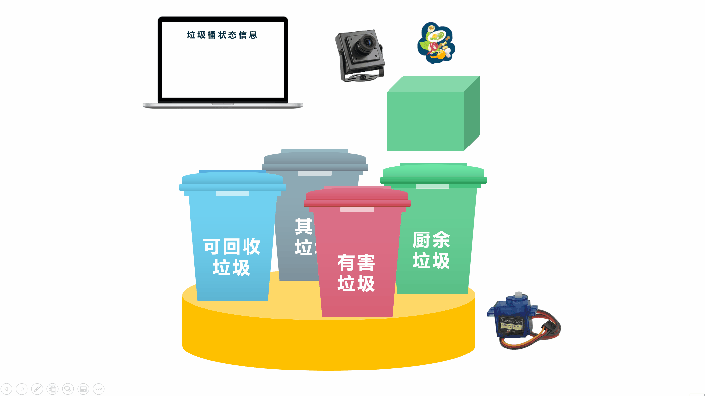

该方案的思路，是将四个垃圾桶放置在一个旋转台上而垃圾投放口固定，每当识别出垃圾的类别之后，对应的垃圾桶会旋转到垃圾投放口的下方，就可以将垃圾投入到对应垃圾桶中

## 方案2：垃圾口倾倒

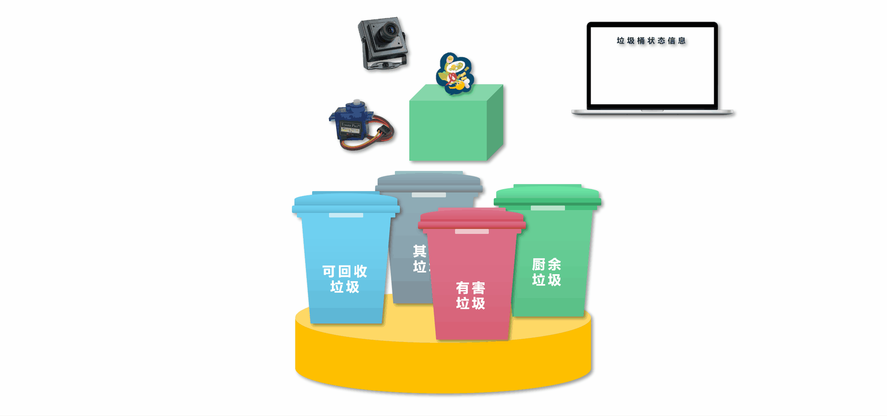

该方案的思路，是将四个垃圾桶固定而垃圾投放口是可以向四个方向倾斜的，这就使得当识别出垃圾之后，垃圾口可以倾斜将垃圾倒入垃圾桶中

该方案的难点是，如何设计一个好的机械结构，将垃圾投放口可以向四周倾斜

## 其他方案

仍然还有其他更好的方案，但是在这里，我们只提出两种方案，其余的可以根据自己的设计需求进行合理设计

# 3、硬件方案

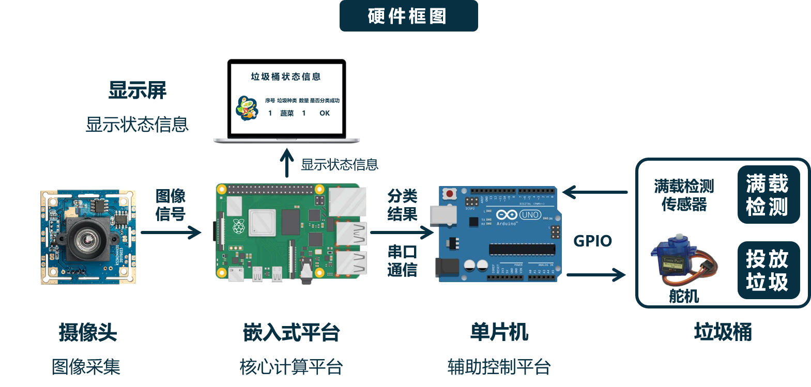

为了完成分类，我们需要一个高性能的嵌入式平台对神经网络进行推理，这是核心的部分。同时需要一个单片机作为辅助控制平台对垃圾桶进行控制，摄像头采集图像，显示器进行分类结果显示和垃圾宣传片的播放，垃圾桶需要一些机械控制模块和用于检测用的传感器

## 嵌入式平台选择
嵌入式平台用多种方案，这里推荐 **树莓派** 和 Nvidia的 **Jetson Nano**，是基于这两个平台的教程较多并且方便使用考虑的

### Raspberry + Intel Neural Computer Stick
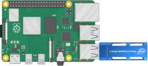

树莓派由于本身没有专用的神经网络推理引擎，所以这里推荐外接 **Intel Neural Computer Stick 2** 作为推理的引擎，网上也有对应的教程

> 不限于使用 intel NCS2 作为树莓派的推理引擎，如果有其他更好的也可以使用

但是这时候需要对训练好的模型进行转换，这点是比较麻烦的，好处是这样可以将**模型的训练**和**模型的推理**进行解耦，使得训练的模型可以根据不同的硬件进行对应的模型转换和部署，这就使得训练的模型是可以不受训练设备的限制进行部署。

> 当使用高性能的设备（例如3080）进行训练之后，测试时候可以达到很高的帧率，但是实际在部署到设备上，无法使用相同的显卡，那么推理速度也就不可能达到当时测试的帧率。
>    
> 但是各大设备厂商都会有一个专门设计和优化的硬件加速引擎，但是需要模型符合这种推理推理引擎的结构，比如只能给卷积层的推理进行加速，这是如果你的神经网络中包含了池化层，就无法进行推理加速了。    
> 并且考虑到各个深度学习的框架都有各自的不足，实际推理的时候受到限制，比如 `tensorflow` 训练的时候能够使用其 `GPU` 版本 `tensorflow-gpu` 进行加速训练，但是实际部署的时候很多嵌入式设备无法安装 `tensorflow-gpu` 的版本，这就使得推理性能无法最优化。
> 
> 因此，这样模型训练和部署分离开来的操作是受到推荐的。例如，由微软、亚马逊、Facebook、IBM 等公司共同开发的 `ONNX` (Open Neural Network Exchange, 开放式神经网络交换)，不同深度学习框架可以将模型保存为ONNX格式，从而实现模型在不同框架之间的转换。

### Nvidia Jetson Nano
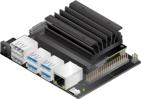

Nvidia Jetson Nano 是英伟达的专为深度学习而设计的嵌入式开发平台。包含了一块 128核 Maxwell 架构的GPU，专用于

> Jetson Nano的主要用处还是实现一些简单的实时视觉识别，适合一些对体积、功耗、价格有要求却需要AI功能的项目中，其余的大部分功能相比树莓派并没有明显优势，反倒问题很多（初期项目资源非常少、经常发烫死机、系统稳定性不如Raspbian、只有有线网卡、对电源要求高等）。   
> Jetson Nano的定位应该属于“入门级的边缘AI计算”，比较适合想要在现有系统的基础上增加一些深度学习功能的场景，也适合想要学习嵌入式AI部署的深度学习开发人员。

## 单片机选择
选择自己熟悉的就可以了


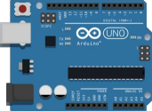

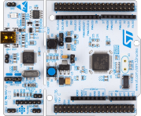

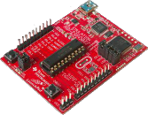


## 显示屏选择

显示屏选择一个便宜的就好了，随便给个[链接](https://detail.tmall.com/item.htm?spm=a230r.1.14.15.28022df4nG38oE&id=614418989128&ns=1&abbucket=3)

## 摄像头选择

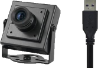

摄像头选择USB摄像头或者树莓派、jetson Nano专用的摄像头就好了

附上链接：
- [树莓派 摄像头 夜视 英伟达jetson nano 摄像头+固定架](https://detail.tmall.com/item.htm?spm=a230r.1.14.7.45e366a0z5N4YN&id=571401069691&ns=1&abbucket=3&skuId=3868571851153)

> 摄像头买100元以下的均能满足要求了
> 
> 送入神经网络推理的图像都会 `rezise` 到 `500*500` 以下的。


## 舵机选择

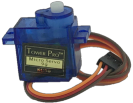

> todo


# 4、软件方案

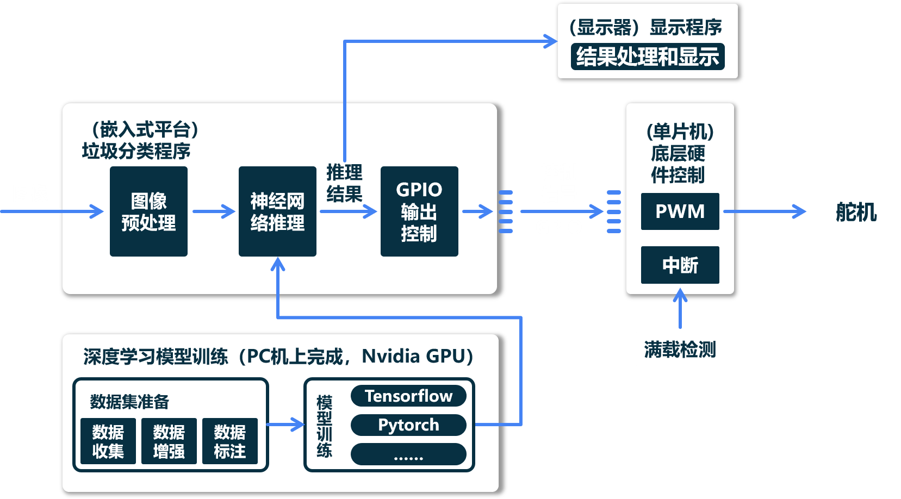

软件部分包括了神经网络的推理，单片机控制，显示显示等

## 神经网络训练
我们需要训练一个能够进行分类的神经网络

神经网络的学习推荐北京大学**曹建**老师的[人工智能实践：Tensorflow笔记](https://www.icourse163.org/course/PKU-1002536002)课程进行入门学习，里面包含了 `VGGNet`、`AlexNet` 等经典神经网络的教程


### 数据集准备
数据集的制作包括了数据搜集、清洗、标注、增强等

数据集需要制作成 `VOC` 或者 `coco` 的格式

### 深度学习框架的选择
#### Tensorflow
> 如果选择 Tensorflow ，请选择 `Tensorflow 2.0` 以上的版本了，并且[安装 GPU 版本](https://pypi.org/project/tensorflow-gpu/)。在安装之前，请安装 `CUDA 10.1` 和 `cuDNN 7.6.5`
```bash
pip install tensorflow-gpu -i https://pypi.tuna.tsinghua.edu.cn/simple/
```

#### pytorc
> pytorch 的[官方网站](https://pytorch.org/)有安装的命令，根据自己的操作系统、语言、CUDA版本来选择安装的命令行    
> Linux 下用 pip 安装 python 版本的 pytorch 1.7.1 stable 版本，系统的 CUDA 版本为10.1
```bash
pip install torch==1.7.1+cu101 torchvision==0.8.2+cu101 torchaudio==0.7.2 -f https://download.pytorch.org/whl/torch_stable.html
```

### 神经网络搭建
可以选用的分类神经网络的模型
- resNeXt
- EfficientNet
- VGG-19/AlexNet

### 模型训练
使用 GPU 进行神经网络的训练需要电脑有一张 Nvidia 的独立显卡，笔记本的 Nvidia 显卡也可以，否则只能使用 CPU 训练。

注意：
- 不要刻意调高 `batch size`
- 散热！散热！散热！

### 模型测试和优化
损失函数最小、精度最高

## 垃圾分类程序
将训练好的神经网络，转换成嵌入式平台可以进行推理的模型，之后写一个推理网络的程序，并且将推理的结果进行转化（网络推理的结果是一堆概率）

## 显示程序
Qt 不解释，自己学。为了省事，建议 Python
```bash
pip install pyqt5 -i https://pypi.tuna.tsinghua.edu.cn/simple/
pip install pyqt5-tools -i https://pypi.tuna.tsinghua.edu.cn/simple/
```

## 单片机上的程序
### PWM 输出
需要输出一个 PWM 波来控制舵机

需要学习 PWM 的原理、中断程序的编写

### 外部传感器中断
传感器在检测到之后会输出一个信号，这个信号就会产生一个外部中断，然后进入中断服务程序中处理该结果
