# 解题方案
- [解题方案](#解题方案)
- [解题思路](#解题思路)
- [垃圾桶的设计](#垃圾桶的设计)
  - [方案一：转台](#方案一转台)
  - [方案二：转台](#方案二转台)
- [硬件方案](#硬件方案)
  - [嵌入式平台选择](#嵌入式平台选择)
  - [单片机选择](#单片机选择)
  - [显示屏选择](#显示屏选择)
  - [摄像头选择](#摄像头选择)
  - [舵机选择](#舵机选择)
- [软件方案](#软件方案)
  - [神经网络训练](#神经网络训练)
    - [数据集准备](#数据集准备)
    - [神经网络搭建](#神经网络搭建)
    - [模型训练](#模型训练)
    - [模型测试和优化](#模型测试和优化)
  - [垃圾分类程序](#垃圾分类程序)
  - [显示程序](#显示程序)
  - [单片机上的程序](#单片机上的程序)

# 解题思路

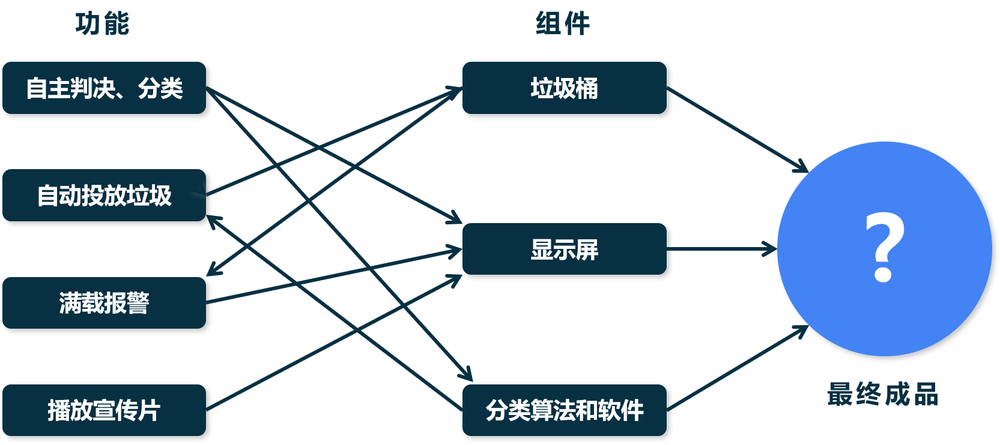

根据赛题的要求，逐个完成每个功能

- 自主判决和分类：这里需要一个垃圾分类的算法，这里选择深度学习的方法进行垃圾分类
- 自动垃圾投放：需要根据分类结果进行判断，再由硬件控制垃圾桶
- 满载报警：根据垃圾桶的内部空间的状态进行检测判断
- 播放宣传片：播放宣传片是需要在没有垃圾投放的空闲时间进行的

# 垃圾桶的设计

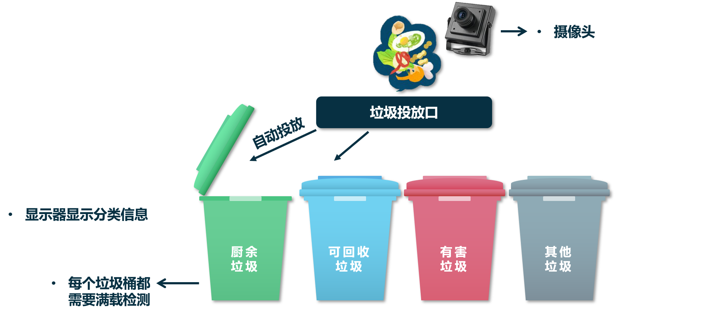

## 方案一：转台

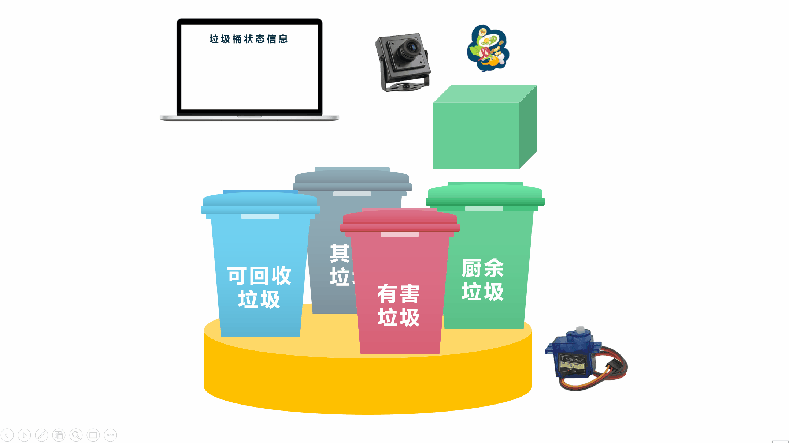

## 方案二：转台

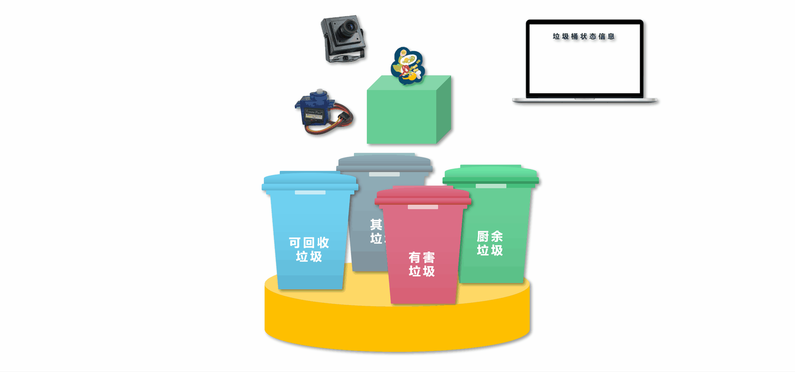

# 硬件方案

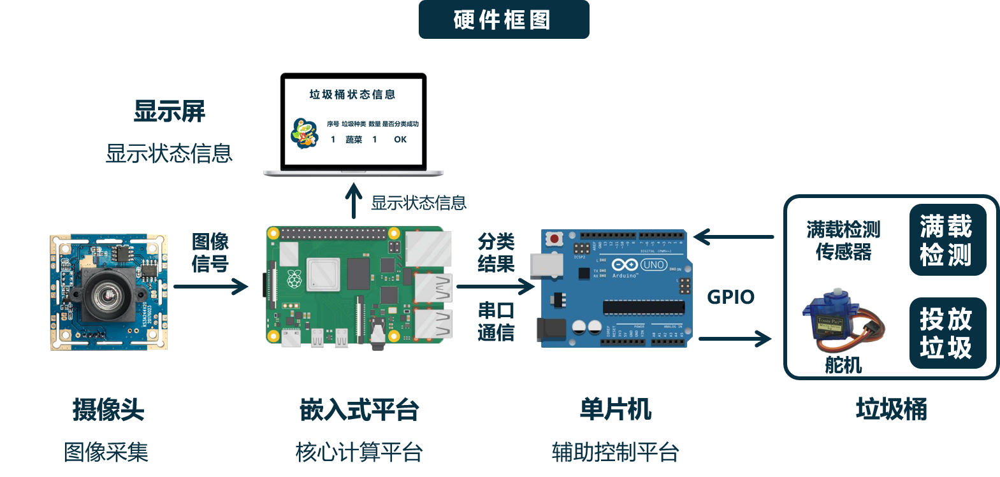

在硬件的选择是上

## 嵌入式平台选择

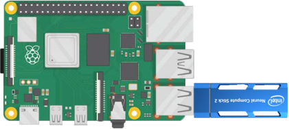

## 单片机选择

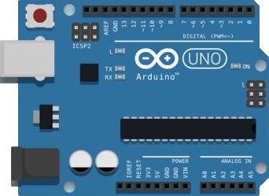

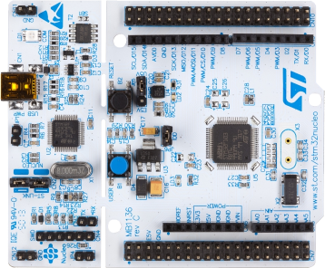

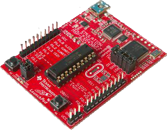

## 显示屏选择

## 摄像头选择

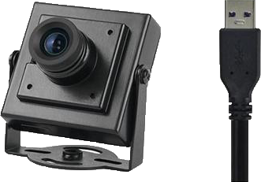

## 舵机选择

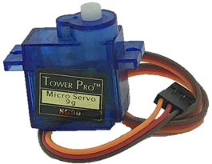

# 软件方案

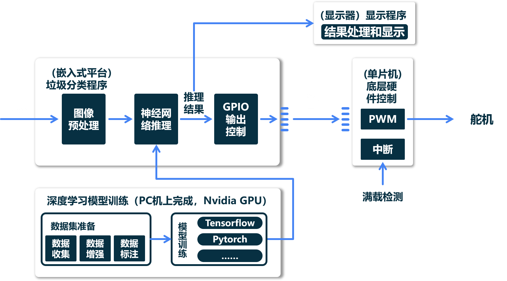

## 神经网络训练

### 数据集准备
数据搜集、清洗、标注、增强

### 神经网络搭建
深度学习框架：Tensorflow、pytorch等
可选模型（分类神经网络）：resNeXt、EfficientNet、VGG-19/AlexNet等

### 模型训练
GPU训练（爱护自己的笔记本）

### 模型测试和优化
损失函数最小、精度最高

## 垃圾分类程序

## 显示程序

## 单片机上的程序

